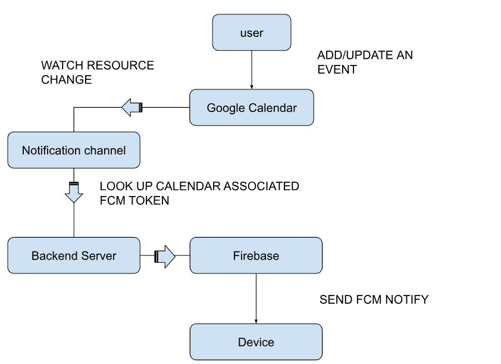


# Calendar App
## Overview
The Calendar app is built using Kotlin and Jetpack Compose, designed to help users manage their tasks efficiently. It provides a calendar view, task management features, and seamless navigation between months.

## Features
- **Calendar View:** Display the current month's calendar, navigate between months, and select specific dates.
- **Task Management:**  Add, view, and delete tasks associated with specific dates.
- **Swipe Gestures:** Navigate between months using swipe gestures.
- **Theming:** Supports both dark and light themes with proper theme switching.
- **User ID Management:** Assigns a unique user ID to manage user-specific tasks.

## Design Patterns and Architecture
- **MVVM (Model-View-ViewModel):** Separates UI code from business logic, making the codebase more maintainable and testable.
- **Clean Architecture:** Divides the app into layers (Presentation, Domain, and Data) to enhance separation of concerns and improve testability.
- **Dependency Injection with Hilt:** Manages dependencies and simplifies the process of dependency injection.
- **Retrofit for API Calls:** Handles network requests efficiently and cleanly.

## APP LINK

[Download the app](https://github.com/sudhanshuGt/MyCalender/blob/main/apk_file/app-debug.apk)

## VIDEO LINK

[Watch the video](https://drive.google.com/file/d/1SBfFRdaWlmRJbuIIBOgpW1rfkaV3f6Pr/view?usp=sharing)

## Code Structure
- **Presentation Layer:** Contains UI-related components built using Jetpack Compose, including the main activity, composables, and view models.
- **Domain Layer:** Contains use cases that encapsulate the business logic.
- **Data Layer:** Contains data models and repositories for managing data sources, including network and local storage.

### Workflow Of Receiving Calendar Event Notification

When an old user adds or updates an event at Google Calendar, 
the Google Calendar API that is watching the calendar resource changes will send a notification to the registered notification channel. 
The webhook that subscribes to the notification channel will look up the FCM token in database for the user based on the calendar id 
from the notification message, then it will send a FCM notification to the app based on the FCM token for sending an app reminder and data collection. 

### NEW USER NOTIFICATION REGISTRATION

For a new user, we first create a new FCM token by sending a firebase messaging onNewToken request. 
This FCM token will be the key-value pair associated with the user’s google account calendar token. 
Meanwhile, we send a one-time build notification request to Google push notifications to establish a notification channel as watchdog. 
Since the notification channel can only send notifications to route with /notification syntax, 
we run an nginx reverse to port 4000 for our backend flask server to forward packets there on EC2.

### SCHEDULE REMINDER
Upon receiving an FCM message, the local eventDB will insert a new record that stores the event name, startTime. 
Meanwhile, the reminder manager will schedule the next upcoming record. 
When the startTime matches the current time, there will be a notification pop up on the screen.

### Folder Structure
- main: app/src/main/java/dev/sudhanshu/calender/presentation/view

## TECH STACK
- Android App (user interface): Kotlin
- Backend Server (Forward update notification from Google PUSH to FSM): Python (Flask), Nginx
- Messaging: Firebase Cloud Messaging
- APIs: Google Calendar API
- Cloud Services: AWS EC2

